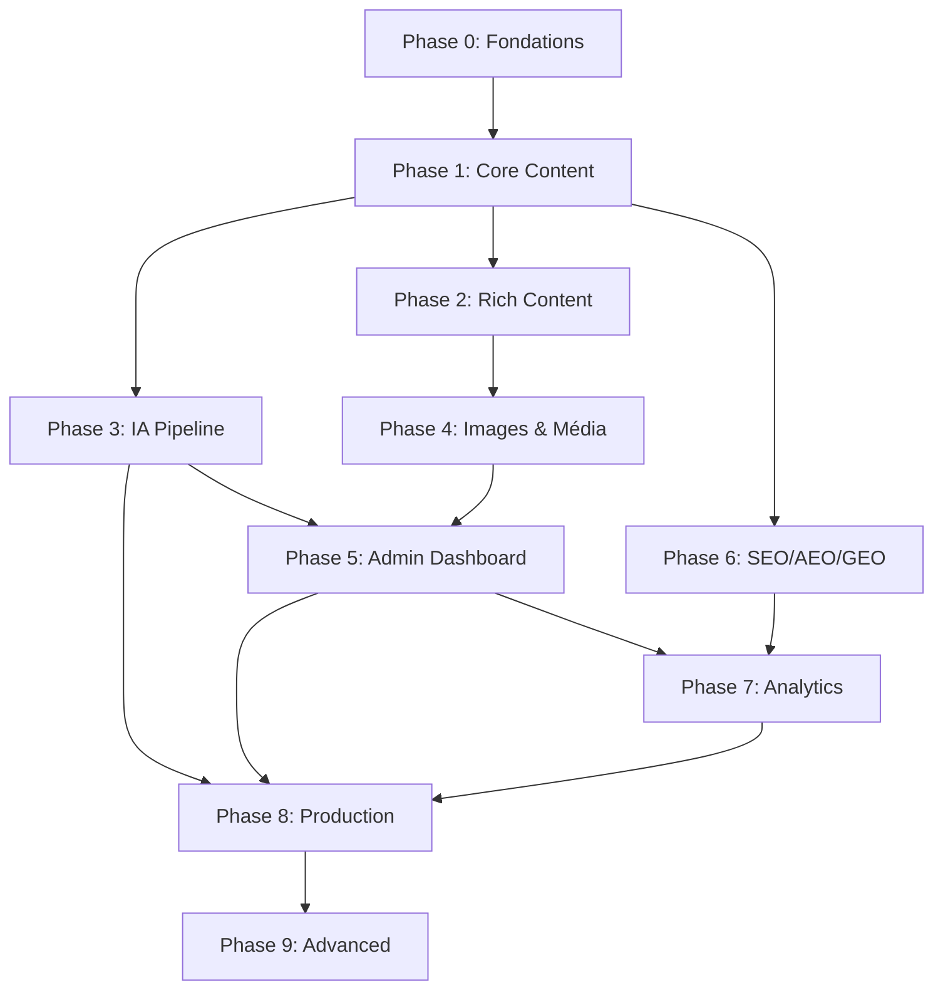

# Forge-Blog — Roadmap de développement

> Dernière mise à jour : 2026-07-19
> Basé sur : `forge-blog-system-prompt.md`

---

## 📋 Légende

| Symbole | Signification |
|---------|---------------|
| ✅ | Terminé |
| 🚧 | En cours |
| ⏳ | Planifié |
| 📝 | À spécifier |

---

## Phase 0 : Fondations (✅ Terminé)

- ✅ **Schéma BDD** — Migrations 001-003 : articles, profiles, pillars, tags, revisions, research_sources, ai_providers, article_scores, review_comments
- ✅ **RLS policies** — Migration 002 : protections par rôle (Owner → Read-only)
- ✅ **Auto-revision** — Migration 20260717_001 : déclencheur de révision automatique
- ✅ **Auth** — Google OAuth via Supabase, `AdminAuthGate`
- ✅ **Localisation** — Détection `Accept-Language` + cookie, EN/FR, LanguageSwitcher
- ✅ **Thème** — Light/Dark mode avec tokens CSS, ThemeToggle
- ✅ **Design system** — Neutres purs + violet accent + shimmer, section 1 du system prompt

## Phase 1 : Core Content Engine (✅ Terminé)

- ✅ **BlockNote editor** — v0.51.4 intégré, édition des body blocks
- ✅ **Section-10 scaffold** — hero_meta, key_takeaway, toc_anchor, body_blocks, conversion_block, related_articles_anchor
- ✅ **Types de blocs** — paragraph, h2/h3, callout, quote, table, code, toggle, checklist, image, bookmark, equation, mermaid, footnotes, embed, divider, diagram, product_bridge_inline
- ✅ **Validation** — `validateArticleContent()` avec erreurs/warnings
- ✅ **Mapping BlockNote ↔ BodyBlock** — `from-blocknote.ts` bidirectionnel
- ✅ **Rendu public** — `BlockRenderer.tsx`, tous les cas gérés

## Phase 2 : Rich Content (✅ Terminé)

- ✅ **KaTeX / équations** — `EquationBlockView` (public) + bloc math BlockNote (éditeur)
- ✅ **Mermaid / diagrammes** — `MermaidBlockView` (public, mode sombre) + bloc mermaid BlockNote (éditeur)
- ✅ **Markdown avancé** — Footnotes avec back-links, YouTube embeds (youtube-nocookie), tableaux complexes (expand/collapse)
- ✅ **React Flow** — Diagrammes existants (`DiagramBlockView`)
- ✅ **Code highlighting** — Prism.js avec copy button

## Phase 3 : IA Pipeline (✅ Terminé partiel)

- ✅ **Provider abstraction** — `lib/ai/` : adaptateurs Anthropic, OpenAI, Custom
- ✅ **Edge Functions** — `ai-brief-generation`, `ai-draft-generation`, `ai-seo-aeo-geo-audit`, `sitemap-generate`
- ✅ **Settings UI** — Configuration des providers dans `/admin/settings/ai`
- ✅ **AIGenerationTool** — Assistant IA dans l'éditeur BlockNote
- ✅ **Génération de diagrammes/équations par l'IA** — Edge Function dédiée + fallback client + intégration BlockNote

## Phase 4 : Images & Média (✅ Terminé)

- ✅ **Bucket Supabase Storage** — Créer `article-images` bucket avec RLS
- ✅ **Upload API** — `/api/admin/upload` (Supabase Storage + fallback base64 local)
- ✅ **Cover image** — UI d'upload dans l'éditeur d'article
- ✅ **Inline images** — Upload/insertion d'images dans BlockNote
- ✅ **Next/Image** — Optimisation des images côté public
- ✅ **ImageUpload component** — Drag & drop, preview, progress, accessibilité clavier
- ✅ **Upload utility** — `lib/upload.ts` (validation, resize via canvas, async crypto naming)

## Phase 5 : Admin Dashboard (⏳ Planifié)

- ✅ **Article table** — Search/filter/sort avec pagination intelligente
- ✅ **Translation coverage** — Badges Complete / Missing FR / Missing EN
- ✅ **Calendar view** — Planning éditorial mensuel avec navigation, events par statut
- ✅ **Performance metrics** — Dashboard avec KPIs, classements, analyse par pillar
- ✅ **Content health** — Scores SEO/AEO/GEO, health warnings, validation issues
- ✅ **Review workflow** — Revue Kanban, commentaires, résolution, statuts pipeline
- ✅ **Revision history** — Liste chronologique, diff preview, option restore

## Phase 6 : SEO / AEO / GEO (✅ Terminé)

- ✅ **hreflang tags** — Sur toutes les pages (home + articles) avec x-default
- ✅ **Sitemap** — Route /sitemap.xml, segmenté par locale, avec hreflang alternates
- ✅ **Robots.txt** — Route /robots.txt, désactive /admin/ et /api/
- ✅ **Structured data JSON-LD** — Article, BreadcrumbList, Organization, WebSite schemas
- ✅ **Meta fields** — SEO title, meta description, canonical, robots (éditeur + API)
- ✅ **Social preview** — Open Graph enrichi (images 1200×630) + Twitter Cards (summary_large_image)
- ✅ **Content scoring** — 12 dimensions intégrées au dashboard

## Phase 7 : Analytics & Conversion (✅ Terminé)

- ✅ **PostHog provider** — Scroll depth (milestones 25/50/75/90/100%), read completion (IntersectionObserver), page views avec locale, pilier browse, search events
- ✅ **Conversion tracking** — `nainoforge_cta_click`, `scyforge_cta_click` avec article context, timestamp, variante A/B
- ✅ **Performance dashboard** — Métriques synthétiques dans `/admin/analytics` (Phase 5)
- ✅ **A/B testing** — Framework de variantes déterministes (par article ID) : headlines, couleurs, layouts, header
- ✅ **User identification** — `identifyPostHogUser()`, `resetPostHogUser()`, group analytics par compagnie 

## Phase 8 : Production Readiness (⏳ Planifié)

- ⏳ **Tests** — Unitaires (validation, locale, providers) + intégration (pipeline IA) + RLS
- ⏳ **CI/CD** — GitHub Actions : lint → typecheck → test → build
- ⏳ **Déploiement Vercel** — Configuration, environment variables, preview deploys
- ⏳ **Documentation** — README enrichi, instructions de déploiement
- ⏳ **Monitoring** — Alerts, error tracking (PostHog)

## Phase 9 : Fonctionnalités avancées (✅ Terminé)

- ✅ **Search** — API full-text `/api/search`, composant SearchResults avec debounce, highlights, page `/search` avec hreflang, SearchAction JSON-LD, tracking PostHog
- ✅ **Related articles** — Recommandation par pillar (déjà existant, Phase 0)
- ✅ **Newsletter** — API `/api/newsletter/subscribe`, composant NewsletterSignup avec validation email, statuts idle/loading/success/error, ready pour intégration Mailchimp/SendGrid
- ✅ **RSS feed** — `/api/rss?locale=en|fr` — flux RSS 2.0 complet avec item title, link, guid, description, author, pubDate, category, enclosure
- ✅ **PWA** — `manifest.json` avec icônes 192/512, theme_color violet, `sw.js` service worker avec cache-first pour assets, network-first pour contenu, offline fallback
- ✅ **Multi-langue** — `FUTURE_LOCALES` défini dans resolve.ts (DE, ES, IT) ready for activation

---

## Dépendances entre phases

## Priorités immédiates

1. ✅ **Phase 4 — Images & Média** (terminé)
2. **🔥 Phase 5 — Admin Dashboard enrichi** (en cours)
3. **⏳ Phase 3 suite — Génération IA de diagrammes/équations**
4. **⏳ Phase 6 — SEO/AEO/GEO complet**
